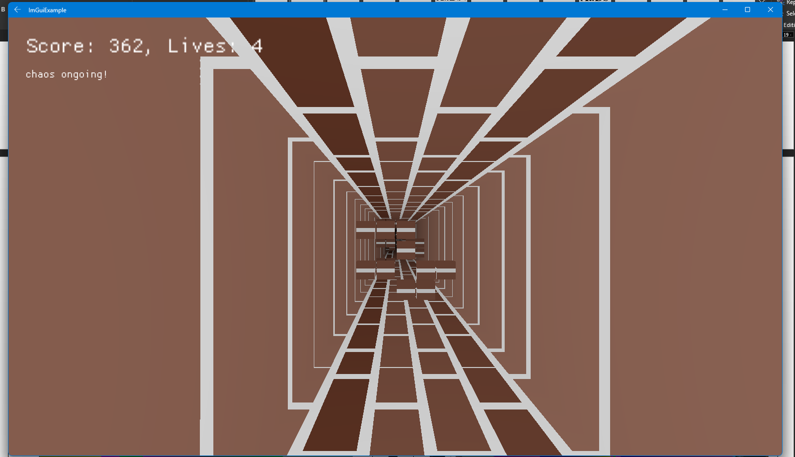

# Endless Tunnel (current status: buggy)

made with the intention of creating game in 1 day (about 13-14 hours).

inside ./runtime/CMakeLists.txt change SETU_DIRECTORY to where SETU Engine installed.
```
# example
GET_FILENAME_COMPONENT (SETU_DIRECTORY "C:/DevDepo/SETU/" ABSOLUTE)
```

see ~scripts/run.ps1 for run instructions or just invoke command `./~scripts/run.ps1 -Windows -Linux -Android` *all three options are optional though at least one is required.


